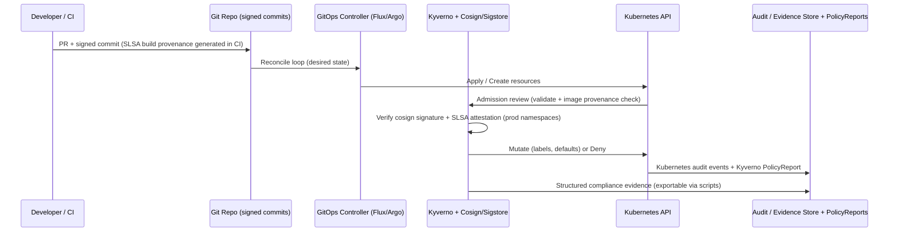
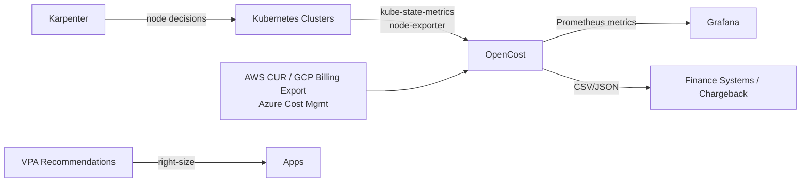

# Architecture: k8s-platform-blueprint

**Strategic Kubernetes Platform Reference Architecture**

This document captures the architectural decisions, trade-offs, evolution path, and rationale behind the platform. It is written for both platform engineers who will implement it and for CTOs and architects who must understand *why* certain choices were made.

---

## Table of Contents

- [Guiding Principles](#guiding-principles)
- [High-Level Architecture](#high-level-architecture)
- [Architecture Decision Records (ADRs)](#architecture-decision-records-adrs)
  - [ADR-001: GitOps as the Source of Truth](#adr-001-gitops-as-the-source-of-truth)
  - [ADR-002: Policy-as-Code Enforcement Layer](#adr-002-policy-as-code-enforcement-layer)
  - [ADR-003: Cost Visibility from Day One (OpenCost primary)](#adr-003-cost-visibility-from-day-one-opencost-primary)
  - [ADR-004: Autoscaling Strategy (Karpenter + HPA + VPA)](#adr-004-autoscaling-strategy-karpenter--hpa--vpa)
  - [ADR-005: Observability Stack (Prometheus + Grafana + OTel + Loki)](#adr-005-observability-stack-prometheus--grafana--otel--loki)
  - [ADR-006: Multi-Cloud & Hybrid Consistency Model](#adr-006-multi-cloud--hybrid-consistency-model)
- [Control Plane vs Data Plane](#control-plane-vs-data-plane)
- [Networking & Connectivity](#networking--connectivity)
- [Security & Compliance Architecture](#security--compliance-architecture)
- [Cost & FinOps Architecture](#cost--finops-architecture)
- [Scaling & Capacity Model](#scaling--capacity-model)
- [Evolution Roadmap](#evolution-roadmap)
- [Trade-off Matrix](#trade-off-matrix)

---

## Guiding Principles

1. **Executive Alignment First**: Every major subsystem must answer "How does this help the CTO justify spend, reduce risk, or accelerate outcomes?"
2. **Declarative & GitOps-Native**: No snowflake clusters. Everything that can be expressed as code lives in Git and is reconciled automatically.
3. **Cost as a First-Class Citizen**: Cost allocation, visibility, and optimization are designed in from the beginning — not bolted on later.
4. **Policy as Guardrails, Not Gates**: Strong defaults with clear remediation paths. Security and compliance teams can audit intent and enforcement.
5. **Progressive Disclosure & Portability**: Works on a laptop (kind/minikube) but scales to multi-region, multi-cloud, regulated environments.
6. **Observability for Humans and Executives**: Dashboards exist for operators *and* for board-level reporting.

---

## High-Level Architecture

The platform follows a layered, defense-in-depth model designed for executive oversight, strong security posture (including SLSA supply-chain guarantees and EU CRA compliance), cost transparency, and portability across clouds and on-premises.

```mermaid
flowchart TB
    subgraph "Business & Executive Layer"
        Exec[CTOs / Board / Platform Governance<br/>ROI, Risk Heatmaps, SLA Burn, Unit Economics]
        Strategy[Strategic Decisions<br/>Investment, Risk Appetite, Compliance Scope]
    end

    subgraph "Governance & Supply Chain Layer (SLSA + CRA)"
        GitOps[GitOps Controller<br/>Flux / Argo CD<br/>Single Source of Truth + Drift Detection]
        PolicyEngine[Policy-as-Code Engine<br/>Kyverno (primary) + Gatekeeper<br/>Admission + Mutation + Reports]
        SupplyChain[Supply Chain Controls<br/>Cosign Signing + SLSA Provenance<br/>SBOMs + Image Freshness + Registry Policy]
        IAM[Identity, RBAC & Break-Glass<br/>Least Privilege + Just-in-Time + Audit]
    end

    subgraph "Platform Control Plane Services"
        FinOps[Cost & FinOps<br/>OpenCost + Kubecost-like<br/>Allocation Labels + Chargeback + Budgets<br/>Spot/Right-sizing ROI]
        Autoscaling[Karpenter + HPA/VPA<br/>Cluster + Workload Autoscaling<br/>Consolidation + Predictive]
        Connectivity[Connectivity & Service Mesh (opt)<br/>Cilium / Calico NP + Istio/Linkerd<br/>Multi-cluster East-West]
    end

    subgraph "Observability & Feedback Loop"
        Metrics[Metrics<br/>Prometheus + Thanos / VM]
        LogsTraces[Logs + Traces<br/>Loki + Tempo/OTel + Jaeger]
        Dashboards[Grafana<br/>Operator Dashboards +<br/>CTO Executive Folder (ROI, Risk, SLA)]
        Alerting[Alertmanager + Runbooks<br/>Business-Impact + Error Budget Alerts]
    end

    subgraph "Workload / Data Plane (Tenant Namespaces)"
        Workloads[Applications & Jobs<br/>Learner Platforms, APIs, Batch<br/>OTel Instrumentation]
        Tenants[Namespace Tenants<br/>Quotas + Cost Labels + NetworkPolicies<br/>PDBs + Topology Spread]
    end

    subgraph "Infrastructure Layer (Multi-Cloud + Hybrid)"
        Cloud1[AWS EKS<br/>+ CUR Billing + IRSA]
        Cloud2[GCP GKE<br/>+ Billing Export + WI]
        Cloud3[Azure AKS<br/>+ Cost Mgmt + WI]
        OnPrem[On-Prem / VMware / Edge<br/>CAPI or Talos + Static Cost Model]
        Net[Cross-Cloud Connectivity<br/>Transit Gateway / Interconnect / VPN / Submariner]
    end

    %% Flows
    Strategy --> GitOps
    Exec --> Dashboards
    GitOps -->|Desired State| PolicyEngine
    PolicyEngine -->|Mutate / Validate / Deny| Cloud1 & Cloud2 & Cloud3 & OnPrem
    SupplyChain --> PolicyEngine
    IAM --> PolicyEngine
    FinOps --> Dashboards
    Autoscaling --> Cloud1 & Cloud2 & Cloud3
    Metrics & LogsTraces --> Dashboards
    Alerting --> Exec
    Workloads --> Metrics & LogsTraces
    Workloads --> Tenants
    Tenants --> PolicyEngine
    Cloud1 & Cloud2 & Cloud3 & OnPrem --> Net
    Net --> Workloads
```

**Key Data Flows (detailed)**:
- **GitOps flow**: Developer PR → Git (signed commits) → GitOps controller reconciles desired state across all clusters. Policy engine intercepts at admission.
- **Supply chain / SLSA flow**: CI builds → cosign sign + generate SLSA provenance attestation (predicate v1) + SBOM → push to registry → Kyverno verify-image + attestations at Pod create time in prod namespaces.
- **Cost / FinOps flow**: Workloads + nodes emit kube-state + cloud billing exports → OpenCost → Prometheus metrics + CSV/JSON exports → Grafana + finance systems. Mandatory cost labels enforced by policy.
- **Observability feedback**: Apps emit OTel → collectors → backends → Grafana (executive views aggregate ROI, risk, multi-cluster health, error budget burn). Alerts include business context.
- **Scaling flow**: Unschedulable pods or HPA metrics → Karpenter (or CA) provisions right-sized/spot nodes → consolidation removes idle capacity.
- **Cross-cluster / hybrid**: Declarative manifests + policy placement rules + service mesh or cloud interconnect for traffic and failover.
- **Compliance evidence**: Git history + PR approvals + Kyverno PolicyReports + audit logs + generated compliance reports (scripts/compliance-scan.sh) provide continuous audit trail.

This diagram (and the ADRs below) directly support EU CRA requirements for cybersecurity by design/default, secure SDLC, vulnerability management, and documentation of the "product with digital elements" (the platform and workloads built upon it).

**Core Design Principles** (repeated for emphasis):
- GitOps as the single source of truth
- Policy-as-code as the enforcement mechanism (preventive + evidence)
- Cost visibility and allocation at the namespace/tenant level from day one
- Observability that serves both operators and executives
- Progressive disclosure + strong supply chain (SLSA) and regulatory alignment (including EU CRA)
- Portability: simple local start (kind) → production multi-cluster / hybrid / regulated environments
```

**Key Data Flows** (legacy high-level, kept for reference):
- Git → GitOps Controller → Desired State in all clusters
- Policy Controller mutates/validates at admission time
- Workloads emit OTel metrics/traces → Collectors → Backend
- OpenCost scrapes kube-state-metrics + cloud billing → Cost DB → Grafana + exports
- Karpenter observes unschedulable pods and cloud capacity → launches nodes

> **New detailed layered diagram above** provides the canonical view used for board-level explanations, architecture reviews, and onboarding. It explicitly calls out SLSA provenance and EU CRA-relevant controls.

---

## Architecture Decision Records (ADRs)

### ADR-001: GitOps as the Source of Truth

**Status**: Accepted

**Context**: We need reproducible, auditable, and rollback-capable cluster and application state across many environments and providers.

**Decision**: Use GitOps (Flux preferred for its strong multi-tenancy and Kustomize/Helm support; Argo CD as alternative) as the sole mechanism for applying changes to clusters.

**Consequences**:
- Positive: Full audit trail in Git, easy PR reviews, automatic drift correction, excellent integration with policy.
- Positive: Enables progressive delivery and canary/automated rollback patterns.
- Negative: Requires discipline around Git workflows and secrets management (external-secrets or SOPS recommended).
- Trade-off: Slightly slower initial "apply" compared to imperative `kubectl apply`, but far superior for production.

**How this helps CTOs**: Provides an immutable record of *who changed what and when* — critical for compliance, incident postmortems, and demonstrating control to auditors and boards.

---

### ADR-002: Policy-as-Code Enforcement Layer

**Status**: Accepted

**Context**: Manual reviews and tribal knowledge do not scale. We need automated, versioned, testable controls that can be mapped to regulatory frameworks.

**Decision**:
- Primary: Kyverno (easier to read/write for most teams, excellent mutation + validation, good performance).
- Secondary / advanced: OPA Gatekeeper for complex rego policies when needed.
- Both can coexist; Kyverno covers 80-90% of common needs.

**Policies cover**:
- Pod Security (restricted / baseline profiles)
- Required labels and annotations (cost-center, owner, environment)
- Image provenance and signing (cosign / SLSA)
- Resource requests/limits mandatory
- No privileged containers, hostPath restrictions, etc.
- Network policy generation helpers
- Compliance evidence collection

**Consequences**:
- Strong guardrails without slowing delivery when policies are well-designed.
- Violations surface in PRs and at admission time.
- Reports can be exported for audit.

**How this helps CTOs**: Turns "we think we're secure" into "here is automated, continuous evidence of policy compliance mapped to SOC2 CC6/CC7 and ISO 27001 Annex A controls."

---

### ADR-003: Cost Visibility from Day One (OpenCost primary)

**Status**: Accepted

**Context**: Most organizations discover cost problems 12–18 months after initial Kubernetes adoption. By then, cultural and architectural debt is high.

**Decision**:
- Deploy OpenCost on every cluster from the first day.
- Enforce cost allocation labels (`cost-center`, `team`, `product`, `environment`) via policy.
- Provide namespace-level quotas and budget alerts.
- Build chargeback/showback pipelines (CSV/JSON exports + integration points for finance systems).
- Include simulation tooling (`scripts/cost-simulation.sh`) so teams can model savings before changing architecture.

**Kubecost-like parity**:
- Right-sizing recommendations surfaced via VPA + custom dashboards
- Idle cost detection
- Spot vs on-demand breakdown
- Shared cost allocation (platform overhead)

**Consequences**:
- Up-front instrumentation cost (small).
- Cultural shift: teams now see the cost of their decisions immediately.
- Enables accurate unit economics (cost per learner, cost per transaction).

**How this helps CTOs**: You can walk into a board meeting with "Platform cost per active user is $X and trending down 18% QoQ because of these three changes" backed by data.

---

### ADR-004: Autoscaling Strategy (Karpenter + HPA + VPA)

**Status**: Accepted

**Context**: Education platforms experience extreme, predictable spikes (exam seasons, course launches) and long periods of lower utilization. Manual capacity management is slow and expensive.

**Decision**:
- **Cluster level**: Karpenter as primary (fast provisioning, spot support, bin-packing, consolidation). Cluster Autoscaler as fallback for simpler environments.
- **Workload level**: HPA (CPU/memory + custom metrics) + VPA (recommendations or auto mode for stateless where safe).
- Combine with pod disruption budgets and topology spread constraints for resilience.

**Consequences**:
- Dramatic reduction in idle capacity (often 30-60% savings in simulations).
- Faster reaction to load than node groups.
- Requires good requests/limits and disruption budgets.

**How this helps CTOs**: Converts fixed cost into variable cost aligned with actual demand. Spot usage can be reported as a direct margin lever.

---

### ADR-005: Observability Stack (Prometheus + Grafana + OTel + Loki)

**Status**: Accepted

**Context**: Need both deep operational visibility and high-level executive views. Must support multi-cluster aggregation and long-term retention for trends and compliance.

**Decision**:
- Metrics: Prometheus (or Thanos/VictoriaMetrics for scale) + remote write options.
- Logs: Loki (cost-effective, labels match Kubernetes).
- Traces: OpenTelemetry + Jaeger or Tempo.
- Dashboards: Grafana as the single pane — includes core platform, application golden signals, cost, and dedicated **CTO / Executive** folder.
- Alerting: Alertmanager with severity tiers and runbooks. Business-impact annotations on alerts.

**Consequences**:
- Excellent signal-to-noise when properly tuned.
- Grafana can be the "source of truth" for both SREs and finance.
- OTel future-proofs instrumentation.

**How this helps CTOs**: One set of dashboards can answer "Are we healthy?" and "Are we getting the business outcomes we paid for?" without translation layers.

---

### ADR-006: Multi-Cloud & Hybrid Consistency Model

**Status**: Accepted

**Context**: Vendor lock-in risk, regional pricing differences, data residency, and resilience requirements often force multi-cloud or hybrid footprints.

**Decision**:
- Use declarative Kubernetes manifests + policies as the portable layer.
- Terraform (or Crossplane) for *provisioning* clusters and base infrastructure — modules per cloud with consistent outputs (kubeconfig, OIDC, etc.).
- Connectivity: Cloud-native (Transit Gateway / Interconnect) + optional service mesh for application-level traffic.
- Workload placement driven by labels + policy (e.g., "this namespace must run in region X or on-prem for data residency").
- Avoid cloud-specific CRDs in application manifests where possible.

**Consequences**:
- Higher initial complexity than single-cloud.
- Much better negotiating position and resilience.
- Requires disciplined abstraction (use Flux Kustomize overlays or Helm values per environment).

**How this helps CTOs**: Reduces single-vendor risk, enables best-price procurement, and satisfies regulatory requirements without custom snowflakes per cloud.

---

## Control Plane vs Data Plane

- **Control Plane (Platform)**: GitOps, Policy, Cost, Autoscaling controllers, Observability. Runs in dedicated `platform-system` or `monitoring` namespaces. Protected by strict RBAC and network policies.
- **Data Plane (Workloads)**: Application namespaces with tenant-specific quotas, labels, and policies. Developers interact primarily through GitOps PRs and self-service where enabled.

Separation ensures platform stability even when tenant workloads misbehave.

---

## Networking & Connectivity

- Default: Calico or Cilium CNI (Cilium preferred for eBPF observability and policy).
- Intra-cluster: NetworkPolicies enforced by policy controller for all non-system namespaces.
- Inter-cluster / Hybrid:
  - Option A: Cloud VPN / Transit Gateway + shared service discovery (CoreDNS overrides or service mesh).
  - Option B: Submariner or Liqo for direct cross-cluster service connectivity.
  - Option C: Service mesh with east-west gateways (Istio or Linkerd + multi-cluster support).
- Egress control: Policy + optional egress gateways for compliance.

---

## Security & Compliance Architecture

The detailed layered Mermaid diagram in the [High-Level Architecture](#high-level-architecture) section is the primary reference. It shows the Governance & Supply Chain Layer explicitly calling out SLSA provenance and EU CRA-relevant controls.

For the change + admission control flow, see this sequence:



**Implemented Controls** (see `manifests/clusters/policies/kyverno/` and the new `verify-slsa-provenance.yaml`):
- Image signing and verification (cosign + SLSA provenance attestations) — enforced in production via the new policy.
- Supply chain: SBOM generation recommended in CI; SLSA provenance generation via GitHub Actions (see `.github/workflows/slsa-provenance.yml` and enhanced guidance).
- Secrets: External Secrets Operator + cloud KMS or Vault.
- Runtime: Falco or Tetragon (optional advanced) + eBPF policy options.
- EU CRA alignment: Cybersecurity by design/default (policy-enforced secure baselines), vulnerability management (image freshness, scanning, SBOM), secure SDLC (GitOps + provenance + policy gates), documentation & evidence (automated reports + this architecture).

**Compliance mapping** (full details and EU CRA table): `docs/governance-compliance-and-security.md`.

The architecture is explicitly designed so that the platform (and applications built on it) can more easily demonstrate conformity with the EU Cyber Resilience Act for "products with digital elements".

---

## Cost & FinOps Architecture



- Allocation labels are **mandatory** (enforced by Kyverno).
- Shared costs (control plane, platform services) are allocated via configuration.
- Budget CRDs or annotations drive alerts.
- Simulation tooling allows modeling "what if we moved 70% to spot and right-sized the top 20 workloads?"

---

## Scaling & Capacity Model

- **Stateless services**: HPA on CPU + request rate + custom business metrics. PDBs and topology spread.
- **Batch / training jobs**: Dedicated node pools or Karpenter node classes with taints. Priority classes.
- **Bursty education workloads**: Predictive scaling via scheduled cluster capacity + Karpenter consolidation during quiet periods.
- **Multi-cluster**: Use labels + GitOps overlays. Global load balancing (external DNS + health checks) or service mesh.
- Load testing patterns are provided in `scripts/scaling-test.sh` and `examples/labs/`.

---

## Evolution Roadmap

**Phase 1 (MVP)**: Single cluster (kind/EKS), GitOps, Kyverno baseline, OpenCost, core observability, sample apps.
**Phase 2**: Multi-environment (dev/staging/prod), Karpenter, chargeback pipelines, executive dashboards.
**Phase 3**: Multi-cloud (EKS + GKE + AKS), hybrid connectivity, advanced policy (image signing, data residency), SLO-based alerting.
**Phase 4**: Platform self-service (Backstage or similar portal), advanced FinOps (savings plans + RI automation), **production SLSA L3 provenance** (hermetic builds, full attestation verification in policy), EU CRA conformity evidence automation, chaos engineering + resilience drills integrated into GitOps.

---

## Trade-off Matrix

| Decision Area          | Option A (Chosen)                  | Option B                     | Key Trade-off                              | When to Reconsider          |
|------------------------|------------------------------------|------------------------------|--------------------------------------------|-----------------------------|
| GitOps                 | Flux (primary) / Argo CD           | Pure Helm / kubectl          | Velocity vs auditability & safety          | Very small teams            |
| Policy                 | Kyverno primary + Gatekeeper       | Only Gatekeeper              | Ease of authoring vs expressiveness        | Heavy Rego investment       |
| Cost Engine            | OpenCost (primary) + Kubecost-like | Kubecost commercial only     | Cost vs features & support                 | Need advanced SaaS features |
| Autoscaler (cluster)   | Karpenter                          | Cluster Autoscaler only      | Speed + spot vs simplicity                 | Regulated air-gapped envs   |
| Observability DB       | Prometheus + Loki                  | Full ELK / commercial        | Cost & K8s-native vs all-in-one            | Massive log volume          |
| Multi-cloud            | Terraform modules + portable manifests | Cloud-specific operators   | Portability vs cloud depth                 | Deep cloud feature needs    |
| Service Mesh           | Optional (Istio/Linkerd)           | Mandatory                    | Complexity vs mTLS + traffic control       | Simple internal apps        |

This architecture is intentionally opinionated where it creates leverage for executives and platform teams, while remaining flexible enough to adapt to specific organizational constraints.

For implementation details, see the `manifests/`, `terraform/`, `scripts/`, and `docs/` directories.
