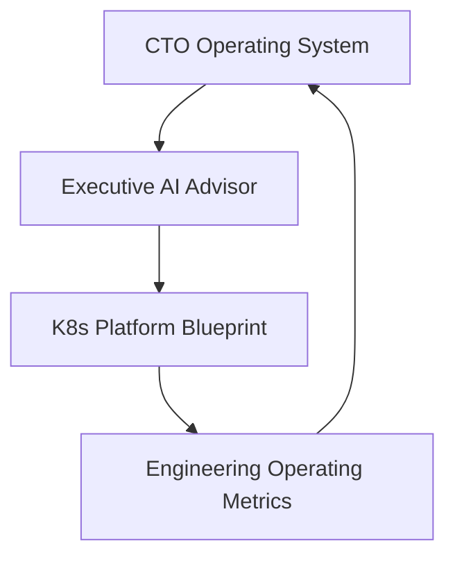

# Technology Leadership Portfolio

## Executive Narrative

This portfolio demonstrates a practical technology leadership system for assessing, operating, governing, implementing, and measuring technology organizations.

It is designed for CTO roles, fractional and interim CTO work, PE operating partner support, board advisory work, technology due diligence, AI governance reviews, and platform modernization programs.

The portfolio is not a collection of unrelated tools. It represents a complete operating model:

1. Define the methodology.
2. Assess the company.
3. Plan the work.
4. Implement governance patterns.
5. Measure outcomes.

## Portfolio Model

## Portfolio Layers

| Layer | Repository | Purpose |
|---|---|---|
| Methodology | [CTO Operating System](https://github.com/serewicz/cto-operating-system) | Defines CTO, diligence, governance, board reporting, and operating partner frameworks |
| Assessment | [Executive AI Advisor](https://github.com/serewicz/Executive-AI-Advisor) | Converts company documents into diligence reports, board briefs, CRA readiness assessments, AI governance assessments, and 100-day technology plans |
| Implementation | [K8s Platform Blueprint](https://github.com/serewicz/k8s-platform-blueprint) | Provides implementation patterns for platform governance, FinOps, observability, policy controls, and compliance evidence |
| Measurement | [Engineering Operating Metrics](https://github.com/serewicz/engineering-operating-metrics) | Measures delivery flow, review quality, rework, engineering cost, AI usage cost, risk, and engineering governance |

## This Repository's Role

K8s Platform Blueprint provides the implementation reference layer. It translates platform and governance findings into patterns for Kubernetes governance, FinOps, observability, policy controls, compliance evidence, and platform operations.
