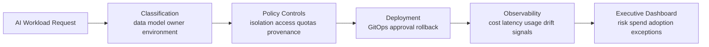

# AI Infrastructure Governance

## Purpose

AI workloads introduce new platform risks: GPU cost spikes, unclear model ownership, data leakage, unmonitored inference paths, and weak rollback controls. This guide defines governance patterns for running AI workloads on Kubernetes responsibly.

## Risk Areas

- uncontrolled GPU spend
- unclear model ownership
- data leakage through prompts, logs, embeddings, or model outputs
- unmonitored inference workloads
- lack of rollback for model releases
- no usage attribution by team, product, customer, or environment
- no governance for internal AI tools
- shadow AI infrastructure outside standard platform controls

## Governance Flow

## GPU Cost Governance

Controls:

- GPU quotas by namespace, team, and environment.
- Required owner, product, model, and cost-center labels.
- Budget alerts for training and inference workloads.
- Idle GPU detection.
- Separate budgets for experimentation and production inference.

Executive questions:

- Which teams consume GPU capacity?
- Is GPU spend tied to product or customer value?
- Are training jobs and inference workloads measured separately?
- Are idle or oversized GPU workloads visible?

## Model Deployment Controls

Controls:

- GitOps-managed deployment definitions.
- model owner and business owner labels.
- documented rollback path.
- versioned model artifacts.
- promotion gates from development to production.
- policy checks for public exposure and data classification.

Evidence:

- deployment history
- model version history
- approval records
- rollback records
- exception register

## Inference Cost Visibility

Track:

- cost per inference request
- cost by model
- cost by customer or tenant where applicable
- cost by product feature
- token or request volume
- latency and error rate
- autoscaling behavior

## Model Observability

Operational signals:

- latency
- errors
- saturation
- request volume
- model version
- resource utilization
- rollback events

Governance signals:

- owner
- data classification
- policy violations
- exception age
- customer or product attribution
- usage trend

## Data Residency and AI Workload Isolation

Controls:

- namespace isolation by environment and data classification.
- node pools for sensitive or regulated workloads.
- network policies for model services and data stores.
- secrets management through approved providers.
- logging rules that prevent sensitive prompt or document leakage.
- residency-aware workload placement.

## Access Controls

Minimum expectations:

- least-privilege access to model deployment namespaces.
- separate production and experimentation permissions.
- break-glass process with audit logs.
- periodic access reviews.
- approval workflow for external model or API access.

## Policy-as-Code for AI Workloads

Example policies:

- require `owner`, `model`, `product`, `environment`, `cost-center`, and `data-classification` labels.
- block GPU workloads without budget label.
- require resource limits for inference workloads.
- deny public ingress for restricted data workloads.
- require approved image registries.
- require signed or provenance-verified images.

## Audit Trails

Evidence should show:

- who changed model deployment configuration
- which model version is live
- what data classification applies
- which policies passed or failed
- which exceptions exist
- how spend is attributed
- when rollback was tested or used

## Executive AI Infrastructure Dashboard

Recommended sections:

| View | Metrics |
|---|---|
| Spend | GPU spend, inference spend, idle GPU cost, cost by team/product/customer |
| Risk | policy violations, public exposure exceptions, sensitive data workloads |
| Ownership | workloads missing owners, model owner coverage, access review status |
| Reliability | inference latency, error rate, saturation, rollback events |
| Adoption | request volume, active products, internal tool usage |
| Governance | exception age, audit evidence completeness, approved model coverage |

## Expected Outcome

AI infrastructure becomes visible, attributable, and governable. Executives can see where AI spend is going, who owns each workload, what controls apply, and where risk needs management attention.
