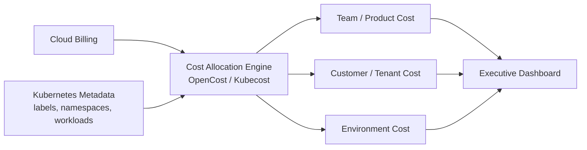

# FinOps and Executive Dashboards

## Purpose

This guide defines how Kubernetes cost, reliability, delivery, and governance signals can be translated into executive dashboard views.

## FinOps Operating Concepts

### OpenCost and Kubecost Concepts

OpenCost and Kubecost-style tools allocate Kubernetes spend using workload metadata, resource consumption, cloud billing data, and namespace ownership. The important executive outcome is not the tool itself. The outcome is financial accountability by team, product, customer, and environment.

### Showback

Showback reports infrastructure cost to teams or business owners without directly charging their budgets. It is useful when a company is introducing cost awareness for the first time.

### Chargeback

Chargeback assigns actual cost to a team, product, business unit, or customer line. It requires mature labeling, finance agreement, and exception handling.

### Labeling Standards

Minimum required labels:

| Label | Purpose |
|---|---|
| `owner` | accountable team or individual |
| `team` | engineering or operating team |
| `product` | product or platform area |
| `environment` | dev, staging, prod, shared |
| `cost-center` | finance mapping |
| `customer` | customer, tenant, or segment where applicable |
| `data-classification` | public, internal, confidential, restricted |

## Cost Allocation Model

## Unit Economics

Use Kubernetes cost data to support business questions:

- What is cost per customer?
- What is cost per workload?
- What is cost per transaction, learner, tenant, or inference request?
- Which workloads create margin pressure?
- Which environments are oversized?
- Where is idle capacity concentrated?

## Executive Dashboard Views

### Board View

Purpose: oversight of risk, spend, reliability, and readiness.

Metrics:

- monthly cloud spend
- cost trend by quarter
- top platform risks
- material security policy violations
- reliability trend for customer-facing workloads
- major platform investment decisions needed

### Operating Partner View

Purpose: portfolio company performance, margin improvement, and risk reduction.

Metrics:

- cost per customer or business unit
- cost trend after optimization actions
- idle capacity
- policy compliance trend
- deployment frequency
- MTTR
- integration or diligence remediation progress

### CTO View

Purpose: operational control and investment prioritization.

Metrics:

- monthly cloud spend by product and environment
- cost per workload
- reliability by service tier
- deployment frequency
- change failure rate
- MTTR
- top policy violations
- platform backlog and adoption

### Platform Team View

Purpose: day-to-day platform operation.

Metrics:

- node utilization
- namespace spend
- idle capacity
- quota pressure
- pod restart trends
- policy violations by namespace
- SLO burn rate
- alert volume
- Karpenter or autoscaler decisions

## Example Dashboard Sections

| Section | Audience | Business Question |
|---|---|---|
| Cloud Spend Trend | Board, CTO, Finance | Is spend predictable and aligned to growth? |
| Cost Allocation | CTO, Finance, Product | Who owns spend and what drives it? |
| Idle Capacity | CTO, Platform | Where can we reduce waste? |
| Reliability Trend | Board, CTO | Are customer-impacting incidents increasing? |
| Security Violations | Security, CTO, Board | Are controls working? |
| Delivery Health | CTO, Product | Is platform investment improving throughput? |

## Operating Cadence

- Weekly: platform team reviews cost anomalies, policy exceptions, and reliability alerts.
- Monthly: CTO reviews spend, reliability, policy trends, and platform roadmap.
- Quarterly: board or operating partner reviews platform risk, cloud spend, major control gaps, and investment needs.

## Expected Outcome

The organization can explain platform cost, risk, reliability, and productivity in a repeatable executive format.
