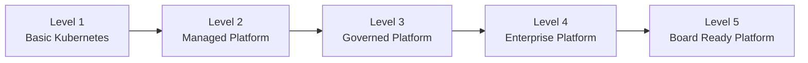

# Platform Governance Maturity Model

## Purpose

This maturity model helps CTOs, operating partners, platform teams, and diligence reviewers assess whether Kubernetes is being run as basic infrastructure or as a governed business platform.

## How to Use It

Use the model during platform strategy reviews, diligence assessments, board reporting, cloud cost reviews, and post-acquisition integration planning. The goal is to identify the next practical level of control, evidence, and operating discipline.

## Level 1: Basic Kubernetes

### Capabilities

- Cluster exists and can run workloads.
- Teams deploy manually or with lightweight scripts.
- Basic namespaces may exist.
- Monitoring is limited to cluster health or cloud-provider defaults.

### Risks

- Cost ownership is unclear.
- Access controls are broad.
- Deployments depend on individual operators.
- Security and compliance evidence is weak.
- Reliability problems are discovered reactively.

### Controls

- Define namespace ownership.
- Require resource requests and limits.
- Add baseline RBAC.
- Establish backup and restore expectations.

### Metrics

- number of workloads without owners
- workloads without resource limits
- cluster spend by month
- incident count

### Executive Concerns

- "Who owns this platform?"
- "What does it cost?"
- "Can we prove what is running?"

### Recommended Next Steps

- Standardize labels, namespaces, and ownership.
- Add basic CI/CD or GitOps.
- Implement a shared observability baseline.

## Level 2: Managed Platform

### Capabilities

- Platform team owns cluster operations.
- GitOps or CI/CD is used for common workloads.
- Basic monitoring and alerting exist.
- Resource quotas are partially defined.
- Cost reporting is visible at the cluster or namespace level.

### Risks

- Platform team may become a manual bottleneck.
- Cost allocation may not map to product or customer economics.
- Policy controls may be advisory instead of enforced.
- Evidence collection may be manual.

### Controls

- GitOps as preferred deployment path.
- Namespace standards by environment.
- Baseline network policies.
- Cost labels for team, product, environment, and owner.

### Metrics

- deployment frequency
- platform request backlog
- percent workloads with ownership labels
- cost by namespace
- alert volume and MTTR

### Executive Concerns

- "Are we improving delivery speed or creating a platform queue?"
- "Can product teams understand their infrastructure cost?"

### Recommended Next Steps

- Introduce policy-as-code.
- Create executive and platform dashboards.
- Define platform service-level objectives.

## Level 3: Governed Platform

### Capabilities

- Policy-as-code enforces workload standards.
- GitOps is the source of truth for platform configuration.
- Cost allocation supports showback.
- Observability covers metrics, logs, traces, and SLOs.
- Security controls produce reusable evidence.

### Risks

- Teams may route around controls if policy exceptions are slow.
- Dashboards may exist but not drive management decisions.
- Compliance evidence may not be organized for audits.
- AI or data workloads may need stronger isolation.

### Controls

- Kyverno or OPA admission policies.
- Required labels for owner, cost center, environment, and data sensitivity.
- Network-policy default deny.
- Image provenance and vulnerability gates.
- Break-glass access process.

### Metrics

- policy violations by team and severity
- cost by product, team, customer, and environment
- SLO attainment
- mean time to restore
- exception aging

### Executive Concerns

- "Are controls reducing risk without slowing engineering?"
- "Can we produce audit evidence without a manual scramble?"

### Recommended Next Steps

- Mature chargeback or budget accountability.
- Add evidence packaging.
- Tie platform metrics to board reporting.

## Level 4: Enterprise Platform

### Capabilities

- Multi-cluster or multi-cloud operations are standardized.
- Platform capabilities are consumed through self-service paths.
- Security, compliance, FinOps, and reliability are measured regularly.
- Platform roadmap aligns to business priorities.
- Incident, access, deployment, and policy evidence is retained.

### Risks

- Cross-cloud complexity can raise cost and operational burden.
- Platform abstractions can hide ownership if service catalogs are weak.
- Governance may lag behind AI, GPU, and data workloads.

### Controls

- Platform service catalog.
- Environment and workload classification standards.
- Automated compliance evidence exports.
- Formal exception review.
- Reliability and cost reviews in operating cadence.

### Metrics

- cost per workload, customer, or business unit
- platform adoption rate
- exception resolution time
- deployment lead time
- reliability trend by service tier
- security policy trend

### Executive Concerns

- "Does platform investment improve margin, resilience, and speed?"
- "Are we ready for acquisition, audit, or regulated-market expansion?"

### Recommended Next Steps

- Create board-ready dashboard views.
- Establish AI infrastructure governance.
- Map platform controls to diligence and audit requirements.

## Level 5: Board-Ready Platform

### Capabilities

- Platform health, spend, security, compliance, and reliability are visible to executives.
- Evidence packages support diligence, audit, and board oversight.
- Cost allocation supports financial planning and unit economics.
- AI workloads are governed with usage attribution, isolation, and rollback.
- Platform controls are tied to business risk and operating priorities.

### Risks

- Overconfidence if dashboards are not reviewed or challenged.
- Metrics drift if ownership changes are not maintained.
- Governance can become stale as products, teams, or regulations change.

### Controls

- Board-level platform dashboard.
- Quarterly platform risk review.
- FinOps operating cadence.
- Compliance evidence repository.
- AI workload governance and audit trails.
- Platform control testing.

### Metrics

- monthly cloud spend trend
- cost per customer, workload, or transaction
- idle capacity
- deployment frequency
- MTTR
- security policy violations
- reliability trends
- audit evidence completeness

### Executive Concerns

- "Can management explain platform risk in business terms?"
- "Are spend, reliability, security, and compliance improving quarter over quarter?"

### Recommended Next Steps

- Use the platform as part of board reporting.
- Review maturity quarterly.
- Tie platform investments to margin, risk, and product outcomes.
