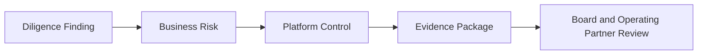

# Technology Due Diligence Mapping

## Purpose

This document maps common technology diligence findings to Kubernetes platform controls and evidence. It helps investors, acquirers, CTOs, and operating partners translate diligence observations into remediation patterns.

## How This Connects to Executive AI Advisor

[Executive AI Advisor](https://github.com/serewicz/Executive-AI-Advisor) can identify diligence findings from uploaded documents and generate cited outputs. This repository shows implementation patterns to address those findings through platform governance, FinOps, observability, and Kubernetes controls.

## Finding-to-Control Mapping

| Finding | Business Risk | Blueprint Area | Suggested Controls | Evidence |
|---|---|---|---|---|
| No cost allocation | Margin erosion and weak accountability | FinOps | OpenCost, required labels, namespace budgets, executive dashboards | cost reports, label coverage, showback reports |
| Weak policy controls | Compliance and security risk | Policy-as-code | Kyverno or OPA, admission controls, exception workflow | policy reports, denied admission events, exception register |
| Limited observability | Operational risk and slow incident response | Observability | Prometheus, Grafana, OpenTelemetry, SLOs, alerting | dashboards, SLO reports, incident timelines |
| Manual deployment risk | Release instability and key-person dependency | GitOps | Argo CD or Flux, deployment history, protected branches | deployment logs, pull request history, rollback records |
| Compliance evidence gaps | Audit delay and control uncertainty | Governance | audit logs, policy reports, access reviews, evidence packages | audit exports, RBAC review, control mapping |
| Overprivileged cluster access | Security exposure and weak segregation of duties | RBAC and IAM | least privilege, break-glass process, periodic access review | access matrix, break-glass logs, review signoff |
| Missing resource requests and limits | Cost waste and noisy-neighbor risk | Resource governance | required resources policy, quotas, VPA recommendations | policy reports, quota reports, utilization trend |
| No workload ownership labels | Slow incident response and unclear accountability | Platform governance | required owner/team/product labels | label compliance reports, ownership map |
| Unclear environment separation | Data leakage and release risk | Environment model | namespace standards, network policies, promotion gates | namespace inventory, network policies, deployment history |
| Uncontrolled AI or GPU workloads | Spend spikes and data governance risk | AI infrastructure governance | GPU quotas, workload isolation, model deployment controls | GPU usage reports, policy exceptions, inference cost reports |

## Management Questions

- Which findings map to direct customer, margin, compliance, or security risk?
- Which findings can be remediated with platform controls rather than manual process?
- Which evidence should be reviewed monthly by the CTO?
- Which evidence should be summarized quarterly for the board?
- Which risks need post-close remediation in the first 100 days?

## Evidence Standards

Strong evidence includes:

- policy reports
- deployment history
- audit logs
- cost allocation reports
- SLO dashboards
- access review records
- incident timelines
- exception registers

Weak evidence includes:

- verbal descriptions without artifacts
- screenshots with no timestamp or ownership
- manually assembled spreadsheets with no source system
- policies that are documented but not enforced

## Post-Diligence Remediation Pattern

1. Translate diligence finding into business risk.
2. Select a platform control.
3. Assign an owner.
4. Define required evidence.
5. Add the work to a 30/60/90-day plan.
6. Review progress in CTO and board operating cadence.

## Expected Outcome

The diligence team can move from finding to action, and the platform team can produce evidence that risk is being reduced.
